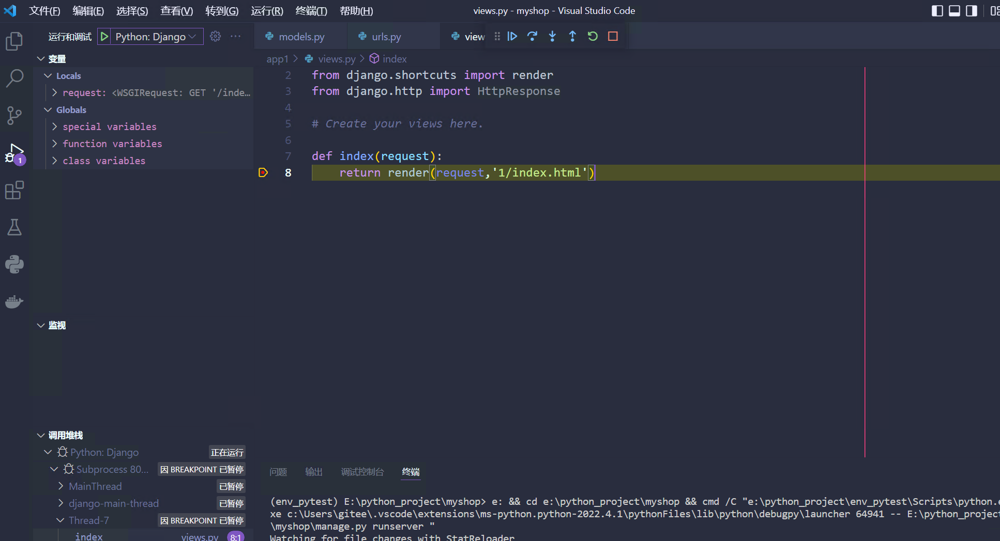

# Django项目的运行和测试

## 1.设置运行环境

（1） 打开vs code 单击菜单  文件-打开文件-选择项目文件夹。

（2）单击python解释器-选择之前创建的虚拟环境的解释器路径。

（3）可以看到vs code的终端已经处于虚拟环境中，剩下所有操作都在虚拟环境中进行。

## 2.调试项目

1. 在项目的任意代码行的行首处单击鼠标左键，出现一个红点，表示打上断点。
2. 设置完断点之后，按F5进行调试，选择“Django启动并调试Django web应用”选项。
3. 打开浏览器访问相应的URL，会停在断点处。
4. 在左侧调试窗口中，从上到下依次显示调试的变量（全局变量和局部变量），监视、调佣堆栈等。

调试快捷键大致如下：

- F5：暂停/继续。
- F10：单步跳过
- F11：单步进入
- Shif + F11：跳出
- F9：切换断点
- Ctrl+F5: 以非调试模式运行

