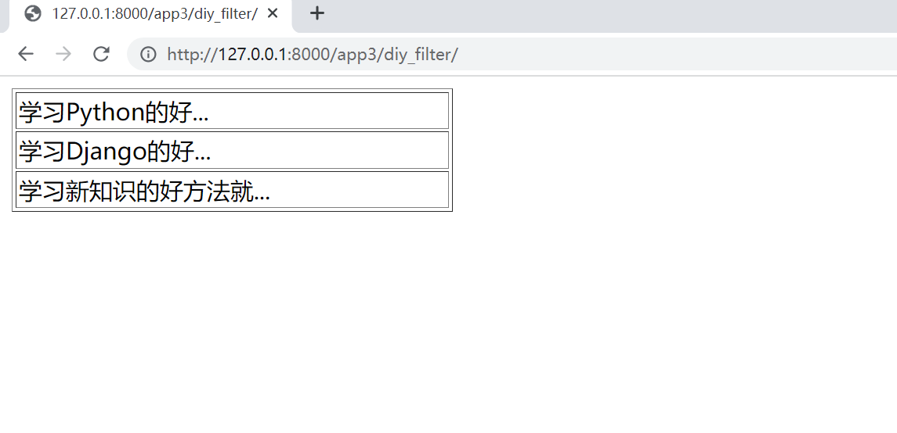
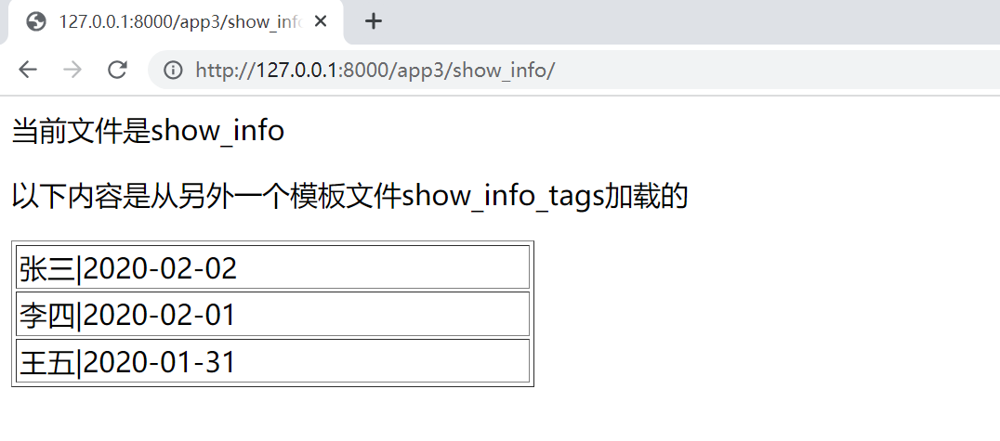
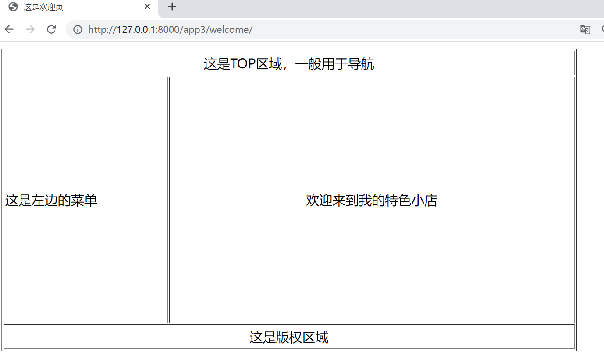

# Django模板语言-DTL


## 1.模板变量


**1. 模板变量的表示**

(1)  模板比那里使用“{{ 变量名 }}”来表示。

```
我的姓名 {{ name }}，我的年龄{{ age }}
```

（2）模板变量还可以是列表、字典以及类对象


**2. 实例**

（1）`app3/views.py`

```python
from django.shortcuts import render
from django.http import HttpResponse
import datetime


def var(request):
    # v=PersonInfo.objects.all()
    # print(v)
    # 列表对象
    lists = ['Java', 'Python', 'C', 'C#', 'JavaScript']
    # 字典对象
    dicts = {'姓名': '张三', '年龄': 25, '性别': '男'}

    return render(request, '3/var.html', {'lists': lists, 'dicts': dicts})
```

render()函数传给模板文件的模板变量名称就是字典的键名称，这样在字典中就可以用这个字典的键名称了。

（2）`templates/3/var.html`

```
{{ lists }}
<table border=1>
    <tr>
        <td>{{ lists.0 }}</td>
        <td>{{ lists.1 }}</td>
        <td>{{ lists.2 }}</td>
        <td>{{ lists.3 }}</td>
        <td>{{ lists.4 }}</td>
    </tr>
</table>
<br>
{{ dicts }}
<table border=1>
    <tr>
        <td>{{ dicts.姓名 }}</td>
        <td>{{ dicts.年龄 }}</td>
        <td>{{ dicts.性别 }}</td>
    </tr>
</table>
```

（2） 编写路由，`app3/urls.py`

```python
from django.contrib import admin
from django.urls import path, include
from app3 import views

urlpatterns = [
    path('app3/var/', views.var)
]
```

然后访问:http://127.0.0.1:8000/app3/var/


## 2.模板标签

参考文献：

https://www.yuque.com/bucea/tb5c6d/gvi5wd#ef4a9db8

https://docs.djangoproject.com/zh-hans/3.2/ref/templates/builtins/#include


### 2.1 条件判断模板标签

条件判断模板标签用于条件判断，由和标签组合的闭合标签。该标签中还可以包含和标签。

（1） 条件判断模板标签一般用法如下：

```

	{{ 内容1 }}

	{{ 内容2 }}

	{{ 默认内容 }}

```

（2）条件判断模板标签的使用

```

	<p> 还未成年 </p>

	<p>恭喜</p>

	<p>你成年了，亚历山大</p>

```

### 2.2 循环模板便签

循环浏览数组中的每个项目，使该项目在上下文变量中可用。例如，要显示 `athlete_list` 中提供的运动员列表：

```
<ul>

    <li>{{ athlete.name }}</li>

</ul>
```

如果你需要访问字典中的项目，这也很有用。例如，如果你的上下文中包含一个字典 `data`，下面将显示该字典的键和值：

```

    {{ key }}: {{ value }}

```

for 循环设置了一组可以在循环体内直接使用的变量：

| 变量名                | 描述                                               |
| --------------------- | -------------------------------------------------- |
| `forloop.counter`     | 循环计数器，表示当前循环的索引（从 `1` 开始）。    |
| `forloop.counter0`    | 循环计数器，表示当前循环的索引（从 `0` 开始）。    |
| `forloop.revcounter`  | 反向循环计数器（以最后一次循环为 `1`，反向计数）。 |
| `forloop.revcounter0` | 反向循环计数器（以最后一次循环为 `0`，反向计数）。 |
| `forloop.first`       | 当前循环为首个循环时，该变量为 True                |
| `forloop.last`        | 当前循环为最后一个循环时，该变量为 True            |
| `forloop.parentloop`  | 在嵌套循环中，指向当前循环的上级循环               |

(1)  `app3/views.py`

```python
from django.shortcuts import render
from django.http import HttpResponse
import datetime


def for_label(request):
    dict1 = {'书名': 'Django开发', '价格': 80, '作者': '张三'}
    dict2 = {'书名': 'Python开发', '价格': 90, '作者': '李四'}
    dict3 = {'书名': 'Java开发', '价格': 100, '作者': '王五'}
    lists = [dict1, dict2, dict3]
    return render(request, '3/for_label.html', {'lists': lists})

```

(2)`templates/3/for_label.html`

```
<table border=1>
    
        <!-- 如果是第一条记录-->
        <tr>
            <td>第一个值：{{ list.书名 }}</td>
        </tr>
        
        <tr>
            <td>当前值：{{ list.书名 }}，价格：{{ list.价格 }}，当前正序索引{{ forloop.counter0 }}，当前倒序索引{{ forloop.revcounter0 }}</td>
        </tr>
        <!-- 如果是最后一条记录-->
        <tr>
            <td>最后一个值：{{ list.书名 }}</td>
        </tr>
        
    
</table>
```

(3) 编写路由规则`app3/urls.py`

```python
from django.contrib import admin
from django.urls import path, include
from app3 import views

urlpatterns = [
    path('app3/for_label', views.for_label)
]
```

(4) 运行访问：http://127.0.0.1:8000/app3/for_label


### 2.3 模板过滤器

- 使用管道符号|来应用过滤器，用于进行计算、转换操作，可以使用在变量、标签中。
- 如果过滤器需要参数，则使用冒号:传递参数。

参考文献：https://www.yuque.com/bucea/tb5c6d/ev8ion

（1）`app3/views.py`

```python
from django.shortcuts import render
from django.http import HttpResponse
import datetime


def filter(request):
    # 定义网址
    # url_addr="<table border=1><tr><td>这是一个表格</td></tr></table>";
    str1 = "abcdefg"
    str2 = "ABCDEFG"
    slice_str = "1234567890"
    time_str = datetime.datetime.now()
    return render(request, '3/filter.html', {"str1": str1, "str2": str2, "slice_str": slice_str, "time_str": time_str})

```

(2) 新建模板文件`templates/3/filter.html`

```
小写转大写：{{ str1|upper }}<br>
大写转小写：{{ str2|lower }}<br>
切片操作：{{ slice_str|slice:"2:4" }}<br>
时间格式化：{{ time_str|date:"Y-m-d G:i:s" }}<br>
```

(3) 编写路由规则 `app3/urls.py`

```python
from django.contrib import admin
from django.urls import path, include
from app3 import views

urlpatterns = [
    path('app3/filter/', views.filter),
]
```

(4) 应用运行后访问：http://127.0.0.1:8000/app3/filter/


## 3. 模板的高级用法

### 3.1 模板转义

Django的模板会对HTML标签和Javascript标签进行自动转义，这样做事未了代码的安全。

例如：Django会将JavaScript脚本代码中的一些字符自动转义，如将"<"转换为“&lt”，将“ ' '”转换为“&#39”。

可以使用“模板变量|safe”的方式告诉Django这段代码是安全的，不需要转义（即关闭模板转义）。

(1) `app3/views.py`中新增视图函数。

```python
from django.shortcuts import render
from django.http import HttpResponse
import datetime

def html_filter(request):
   html_addr="<table border=1><tr><td>这是一个表格</td></tr></table>"
   html_script="<script language='javascript'>document.write('非法执行');</script>"
   return render(request,'3/html_filter.html',{"html_addr":html_addr,"html_script":html_script})
```

(2) 新增模板文件`templates/3/html_filter.html`

```
关闭模板转义-表格：{{ html_addr|safe }}
默认模板转义-表格：{{ html_addr }}<br>

默认模板转义-脚本：{{ html_script }}<br>
关闭模板转义-脚本：{{ html_script|safe }}<br>
```

(3) 编写路由规则 `app3/urls.py`

```python
from django.contrib import admin
from django.urls import path, include
from app3 import views

urlpatterns = [
    path('app3/html_filter/', views.html_filter)
]

```

(4) 运行应用访问：http://127.0.0.1:8000/app3/html_filter/

```
关闭模板转义-表格：
这是一个表格
默认模板转义-表格：<table border=1><tr><td>这是一个表格</td></tr></table>
默认模板转义-脚本：<script language='javascript'>document.write('非法执行');</script>
关闭模板转义-脚本：非法执行
```


## 4.【实战】自定义过滤器


### 4.1 准备工作

在app3下创建一个“templatetags”的包，在包下创建myfilter.py和\_\_init\_\_.py(内容为空)的文件。


### 4.2 编写自定义过滤器并注册

`app3/templatetags/myfilter.py`

```python
from django import template

register = template.Library()


@register.filter
def show_title(value, n):
    if value.__len__() > n:
        return f'{value[0:n]}...'
    else:
        return value
```

@register.filter是一个装饰器，指明show_title()函数是一个过滤器，在show_title()函数中，value是文章标题，n是指标题要显示的长度，当长度大于n时，将后面的内容以...表示。


### 4.3 加载自定义过滤器并编写模板

（1）`app3/views.py`中新增视图函数diy_filter()

```python
from django.shortcuts import render
from django.http import HttpResponse
import datetime


def diy_filter(request):
    dict1 = {'标题': '学习Python的好方法就是每天不间断的写代码'}
    dict2 = {'标题': '学习Django的好方法就是上手做个项目比如CMS、OA等'}
    dict3 = {'标题': '学习新知识的好方法就是快速构建一颗知识树'}
    lists = [dict1, dict2, dict3]
    return render(request, '3/diy_filter.html', {'lists': lists})
```

(2) 新建模板文件`templates/3/diy_filter.html`

```

<table border=1 style="width:300px">
    
        <tr><td>{{ list.标题|show_title:10 }}</td></tr>
    
</table>
```

(3) 添加一条路由规则，`app3/urls.py`

```python
from django.contrib import admin
from django.urls import path, include
from app3 import views

urlpatterns = [
    path('app3/diy_filter/', views.diy_filter),
]

```

(4) 运行应用后访问：http://127.0.0.1:8000/app3/diy_filter/

显示效果



## 5.【实战】自定义标签

自定义标签比过滤标签功能强大，但是实现起来相对复杂，如果Django内置的过滤标签不能满足需求，则可以通过自定义标签的方式实现。

### 5.1 简单标签

简单标签本质上是一个Python函数，要实现简单标签，需要先创建一个名为“template.Library”的实例变量register，然后使用装饰器声明当前函数是一个自定义的简单标签。

（1）新建文件`app3/templatetags/mytags.py`,定义标签函数show_titlr()。

```python
from django import template

register = template.Library()


@register.simple_tag
def show_title(value, n):
    if len(value) > n:
        return f'{value[0:n]}...'
    else:
        return value
```


`@register.simple_tag`是一个装饰器，指明show_title()函数是一个自定义的简单标签。

(2) 定义视图函数diy_tags()

```python
from django.shortcuts import render
from django.http import HttpResponse
import datetime


def diy_tags(request):
    dict1 = {'标题': '学习Python的好方法就是每天不间断的写代码'}
    dict2 = {'标题': '学习Django的好方法就是上手做个项目比如CMS、OA等'}
    dict3 = {'标题': '学习新知识的好方法就是快速构建一颗知识树'}
    lists = [dict1, dict2, dict3]
    return render(request, '3/diy_tags.html', {'lists': lists})
```

(3) 打开模板文件`templates/3/diy_tags.html`,编写代码如下

```

<table border=1 style="width:300px">
    
        <tr><td></td></tr>
    
</table>
```

(4) 编写路由规则 `app3/urls.py`

```python
from django.contrib import admin
from django.urls import path, include
from app3 import views

urlpatterns = [
    path('app3/diy_tags/', views.diy_tags),
]

```

(5) 运行应用，访问：http://127.0.0.1:8000/app3/diy_tags/

此时与自定义过滤器访问内容一样。


### 5.2 包含标签

包含标签（ lnclusion Tags ）是指，通过渲染一些模板来展示数据的标签。

(1) `app3/templatetags/mytags.py`中增加自定义标签函数`show_info_tags()`

```python
from django import template

register = template.Library()


@register.simple_tag
def show_title(value, n):
    if len(value) > n:
        return f'{value[0:n]}...'
    else:
        return value


@register.inclusion_tag("3\show_info_tags.html")
def show_info_tags():
    dict1 = {'标题': '张三|2020-02-02'}
    dict2 = {'标题': '李四|2020-02-01'}
    dict3 = {'标题': '王五|2020-01-31'}
    lists = [dict1, dict2, dict3]
    return {'lists': lists}
```

(2) 新建模板文件`templates/3/show_info_tags.html`

```
<table border=1 style="width:300px">
    
        <tr><td>{{ list.标题 }}</td></tr>
    
</table>
```

`templates/3/show_info.html`

```

<p>当前文件是show_info</p>

<p>以下内容是从另外一个模板文件show_info_tags加载的</p>

```

模板中使用自定义标签，必须先使用进行装载，然后就能在模板中调用自定义的标签函数来显示一段HTML信息。

(3) 编写视图，新增视图函数

```python
from django.shortcuts import render
from django.http import HttpResponse
import datetime


def show_info(request):
   return render(request,'3/show_info.html')
```

(4 ) 编写路由规则 `app3/urls.py`

```python
from django.contrib import admin
from django.urls import path, include
from app3 import views

urlpatterns = [
    path('app3/show_info/', views.show_info),
]
```

(5) 运行访问：http://127.0.0.1:8000/app3/show_info/




## 6. 模板继承

简单来说，模板继承就是建立一个基础的模板（也被称为“母版页”）。改母版页包含网站常见的元素，并且定义了一系列可以被内容页覆盖的“块”（block）。

一个网站会有很多页面，如果多个页面有相同的部分，则可以将相同的部分抽取出来制作成一个母版页，这样可以实现代码的重用、提高开发效率。


### 6.1 设计母版页

大部分后台管理系统的顶部导航、左边菜单、底部的版权信息基本都是保持不变的。下面设计一个后台管理系统的母版页。

`templates/3/base.html`

```
<html>
    <head></head>
    
    <title>这是母版页</title>
    
    <body>
        <table border="1" style="width: 700px;">
            <tr><td colspan="2" style="height:30px;text-align: center;">这是TOP区域，一般用于导航</td></tr>
            <tr style="vertical-align:middle;height:300px;">
                <td style="width:200px;">这是左边的菜单</td>
                <td style="width: 500px;">
                    
                    这个区域随着不同的内容页的变化而变化
                    
                </td>
            </tr>
            <tr><td colspan="2" style="height:30px;text-align: center;">这是版权区域</td></tr>
        </table>
    </body>
</html>

```

针对母版页中的title标签，我们使用block块的占位操作，这些block块会被具体的内容页替换。

### 6.2 设计内容页

（1）设计一个内容页`templates/3/welcome.html`

```


<title>这是欢迎页</title>



<div style="text-align: center;">欢迎来到我的特色小店</div>

```

内容页中使用标签来继承base.html母版页的所有内容，使用标签来重写母版页中的title部分，使用标签来重写母版页中额内容区域。

> extends标签必须是内容页的第1行代码。

如果内容页没有实现母版页中的全部block，在内容页中会默认使用母版页中的block对应的内容。

（2）增加视图函数welcome() ，配置`app3/views.py`代码如下所示

```python
from django.shortcuts import render
from django.http import HttpResponse
import datetime


def welcome(request):
    return render(request, '3/welcome.html')
```

(3) 编写路由规则如下：

```python
from django.contrib import admin
from django.urls import path, include
from app3 import views

urlpatterns = [
    path('app3/welcome/', views.welcome),
]
```

访问：http://127.0.0.1:8000/app3/welcome/，结果如下所示：



### 6.3 设计组件

尽管我们已经为网站设计了母版页，但由于网站页面较为复杂，母版页还是包含了太多的内容。

为了简化母版页的内容，有必要将母版页面拆分成为顶部页面、导航页面、左边菜单页面、底部版权页面、广告位页面等，这些页面是一个个独立的HTML页面，称为“母版页的组件”。

（1）新建文件`templates/3/base_include.html`

```
<html>
<head></head>

    <title>这是母版页</title>


<body>
<table border="1" style="width: 700px;">
    <tr>
        <td colspan="2"></td>
    </tr>
    <tr style="vertical-align:middle;height:300px;">
        <td style="width:200px;">这是左边的菜单</td>
        <td style="width: 500px;">
            
                这个区域随着不同的内容页的变化而变化
            
        </td>
    </tr>
    <tr>
        <td colspan="2" style="height:30px;text-align: center;"></td>
    </tr>
</table>
</body>
</html>
```

这里通过标签和标签的方式引用了top组件和footer组件，从而将复杂的页面进行了简化。

（2）top.html、footer.html组件的内容如下

`top.html`

```
<table border="1" style="width:100%;">
    <tr><td style="height:30px;text-align: center;">这是TOP区域，使用include方式引用</td></tr>
</table>
```

`footer.html`

```
<table border="1" style="width: 100%;">
    <tr><td style="height:30px;text-align: center;">这是版权区域，使用include引用</td></tr>
</table>
```

(3) 最终效果如之前一样。

## 7. 配置模板文件

一个网站包含很多个网页，一个网页由HTML、CSS、JavaScript组成。

### 7.1 理解HTML、CSS、JavaScript

- HTML是用来描述网页的一种语言，一般使用标签`<html></html>`、`<div></div>`来描述网页。
- CSS指层叠样式表，用来定义如何显示HTML元素。层叠样式一般存放在.css文件里。
- JavaScript是脚本语言，通过操作HTML中的标签来动态修改网页。


举例说明：

- HTML是毛坯房，能住人，但是很简陋
- CSS是房屋的装修，能提升访问的舒适性和美观性
- JavaScript是房屋的各种电器设备、通过电器对房屋进行动态调节。

对于一个网页HTML是网页的结构、CSS来描述网页的外观、JavaScript来定义网页的行为，三者有机结合，房子才能真正地适合居住。


Django中CSS和JavaScript这些静态文件放到哪里呢？我们一起来看下


### 7.2 配置静态文件

静态文件包括static和media这两类，这往往容易混淆。static指CSS、JavaScript、Images这样的文件；

media指媒体文件，比如用户上传的文件等。


在Django中，需要在项目`myshop`的根目录下，手动创建static和media文件夹用来存放对应的静态文件，调试模式和生产模式有所不同。


#### 1. Debug=True

Debug=True是“调试”模式，用于调试环境，需要把`myshop/static`静态目录添加到资源集合STATICFILES_DIRS中，这样才能正常访问静态资源。

`myshop/settings.py`,添加内容如下：

```
STATICFILES_DIRS = '/static/'
STATIC_DIR = [os.path.join(BASE_DIR), 'static']
```


#### 2. Debug=False

Debug=False是“生产”模式，用于生产环境，需要修改setting.py和urls.py文件。

```
ALLOWED_HOSTS = [ "*" ]
```

修改setting.py文件如下：

```
STATIC_ROOT = os.path.join(BASE_DIR, 'static')
MEDIA_ROOT = os.path.join(BASE_DIR, 'media')
```

urls.py

```
from django.contrib import admin
from django.urls import path, include, re_path
from django.views.static import serve

from myshop import settings

urlpatterns = [
    re_path('static/(?P<path>.*)', serve, {"document_root": settings.STATIC_ROOT}),
    re_path('media/(?P<path>.*)', serve, {"document_root": settings.MEDIA_ROOT})
]
```


我们测试就使用一张图片进行访问,在static下上传一张图片`static/docker-k8s.png`，验证一下

Debug=True时访问

http://127.0.0.1:8000/static/docker-k8s.png


Debug=False时访问

http://127.0.0.1:8000/static/docker-k8s.png


如上访问都能正常获取的图片的静态文件资源。

