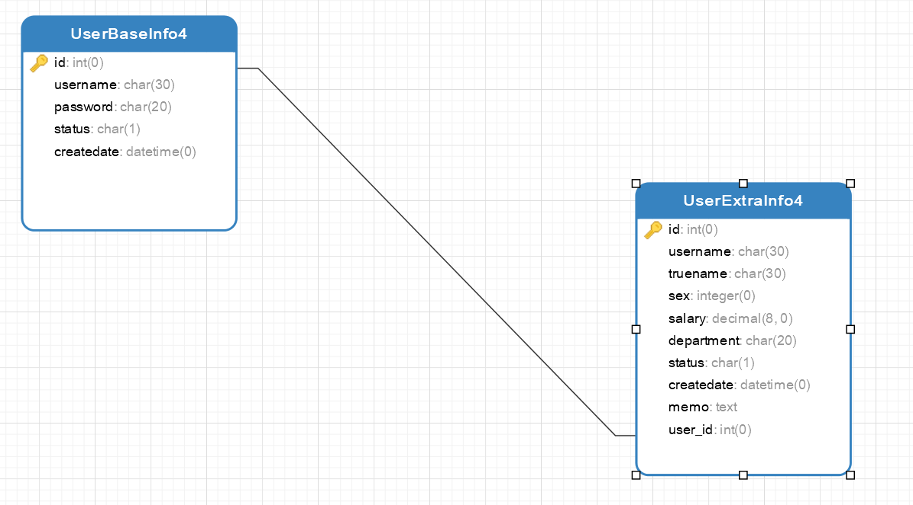

# Django模型

在Django框架中，模型用于描述数据库表结构。模型实例可以实现数据操作。一个模型(Model)对应一个数据库表。

模型中的字段对应数据库表中的一个字段。

在定义好模型后，Django会提供数据库访问的一整套API，从而自动在数据库中生成相应的数据库表，这样就不用SQL脚本建表，或者在数据库中手工创建表格了，大大的提高了开发效率。


## 1.定义模型

所有Django模型都必须继承自Model类，Model类位于包django.db.models中。

下面通过一个实例介绍在Django中定义模型的方法。

新建app4

```shell
$ python manage.py startapp app4
```

注册app4

```
INSTALLED_APPS = [
    'django.contrib.admin',
    'django.contrib.auth',
    'django.contrib.contenttypes',
    'django.contrib.sessions',
    'django.contrib.messages',
    'django.contrib.staticfiles',
    'app1.apps.App1Config',
    'app2',
    'app3',
    'app4'
]
```

`app4/models.py`

```python
from django.db import models
from django.utils import timezone


# Create your models here.

class UserBaseInfo(models.Model):
    id = models.AutoField(verbose_name='编号', primary_key=True)
    username = models.CharField(verbose_name='用户名称', max_length=30)
    password = models.CharField(verbose_name='密码', max_length=20)
    status = models.CharField(verbose_name='状态', max_length=1)
    createdate = models.DateTimeField(verbose_name='创建日期', db_column='createDate')

    def __str__(self):
        return self.username

    class Meta:
        managed = True
        verbose_name = '人员基本信息'
        db_table = 'UserBaseInfo4'
```

### 1.1 常用字段模型

```
AutoField(Field)
        - int自增列，必须填入参数 primary_key=True

    BigAutoField(AutoField)
        - bigint自增列，必须填入参数 primary_key=True

        注：当model中如果没有自增列，则自动会创建一个列名为id的列
        from django.db import models

        class UserInfo(models.Model):
            # 自动创建一个列名为id的且为自增的整数列
            username = models.CharField(max_length=32)

        class Group(models.Model):
            # 自定义自增列
            nid = models.AutoField(primary_key=True)
            name = models.CharField(max_length=32)

    SmallIntegerField(IntegerField):
        - 小整数 -32768 ～ 32767

    PositiveSmallIntegerField(PositiveIntegerRelDbTypeMixin, IntegerField)
        - 正小整数 0 ～ 32767
    IntegerField(Field)
        - 整数列(有符号的) -2147483648 ～ 2147483647

    PositiveIntegerField(PositiveIntegerRelDbTypeMixin, IntegerField)
        - 正整数 0 ～ 2147483647

    BigIntegerField(IntegerField):
        - 长整型(有符号的) -9223372036854775808 ～ 9223372036854775807

    自定义无符号整数字段

        class UnsignedIntegerField(models.IntegerField):
            def db_type(self, connection):
                return 'integer UNSIGNED'

        PS: 返回值为字段在数据库中的属性，Django字段默认的值为：
            'AutoField': 'integer AUTO_INCREMENT',
            'BigAutoField': 'bigint AUTO_INCREMENT',
            'BinaryField': 'longblob',
            'BooleanField': 'bool',
            'CharField': 'varchar(%(max_length)s)',
            'CommaSeparatedIntegerField': 'varchar(%(max_length)s)',
            'DateField': 'date',
            'DateTimeField': 'datetime',
            'DecimalField': 'numeric(%(max_digits)s, %(decimal_places)s)',
            'DurationField': 'bigint',
            'FileField': 'varchar(%(max_length)s)',
            'FilePathField': 'varchar(%(max_length)s)',
            'FloatField': 'double precision',
            'IntegerField': 'integer',
            'BigIntegerField': 'bigint',
            'IPAddressField': 'char(15)',
            'GenericIPAddressField': 'char(39)',
            'NullBooleanField': 'bool',
            'OneToOneField': 'integer',
            'PositiveIntegerField': 'integer UNSIGNED',
            'PositiveSmallIntegerField': 'smallint UNSIGNED',
            'SlugField': 'varchar(%(max_length)s)',
            'SmallIntegerField': 'smallint',
            'TextField': 'longtext',
            'TimeField': 'time',
            'UUIDField': 'char(32)',

    BooleanField(Field)
        - 布尔值类型

    NullBooleanField(Field):
        - 可以为空的布尔值

    CharField(Field)
        - 字符类型
        - 必须提供max_length参数， max_length表示字符长度

    TextField(Field)
        - 文本类型

    EmailField(CharField)：
        - 字符串类型，Django Admin以及ModelForm中提供验证机制

    IPAddressField(Field)
        - 字符串类型，Django Admin以及ModelForm中提供验证 IPV4 机制

    GenericIPAddressField(Field)
        - 字符串类型，Django Admin以及ModelForm中提供验证 Ipv4和Ipv6
        - 参数：
            protocol，用于指定Ipv4或Ipv6， 'both',"ipv4","ipv6"
            unpack_ipv4， 如果指定为True，则输入::ffff:192.0.2.1时候，可解析为192.0.2.1，开启刺功能，需要protocol="both"

    URLField(CharField)
        - 字符串类型，Django Admin以及ModelForm中提供验证 URL

    SlugField(CharField)
        - 字符串类型，Django Admin以及ModelForm中提供验证支持 字母、数字、下划线、连接符（减号）

    CommaSeparatedIntegerField(CharField)
        - 字符串类型，格式必须为逗号分割的数字

    UUIDField(Field)
        - 字符串类型，Django Admin以及ModelForm中提供对UUID格式的验证

    FilePathField(Field)
        - 字符串，Django Admin以及ModelForm中提供读取文件夹下文件的功能
        - 参数：
                path,                      文件夹路径
                match=None,                正则匹配
                recursive=False,           递归下面的文件夹
                allow_files=True,          允许文件
                allow_folders=False,       允许文件夹

    FileField(Field)
        - 字符串，路径保存在数据库，文件上传到指定目录
        - 参数：
            upload_to = ""      上传文件的保存路径
            storage = None      存储组件，默认django.core.files.storage.FileSystemStorage

    ImageField(FileField)
        - 字符串，路径保存在数据库，文件上传到指定目录
        - 参数：
            upload_to = ""      上传文件的保存路径
            storage = None      存储组件，默认django.core.files.storage.FileSystemStorage
            width_field=None,   上传图片的高度保存的数据库字段名（字符串）
            height_field=None   上传图片的宽度保存的数据库字段名（字符串）

    DateTimeField(DateField)
        - 日期+时间格式 YYYY-MM-DD HH:MM[:ss[.uuuuuu]][TZ]

    DateField(DateTimeCheckMixin, Field)
        - 日期格式      YYYY-MM-DD

    TimeField(DateTimeCheckMixin, Field)
        - 时间格式      HH:MM[:ss[.uuuuuu]]

    DurationField(Field)
        - 长整数，时间间隔，数据库中按照bigint存储，ORM中获取的值为datetime.timedelta类型

    FloatField(Field)
        - 浮点型

    DecimalField(Field)
        - 10进制小数
        - 参数：
            max_digits，小数总长度
            decimal_places，小数位长度

    BinaryField(Field)
        - 二进制类型
```

base.py源码内容

```
  data_types = {
        "AutoField": "integer AUTO_INCREMENT",
        "BigAutoField": "bigint AUTO_INCREMENT",
        "BinaryField": "longblob",
        "BooleanField": "bool",
        
        # 字符类型，必须提供max_length参数
        # name=models.CharField(max_length=32,verbose_name='姓名')
        "CharField": "varchar(%(max_length)s)",	
        
        # 日期字段。
        # date=models.DateField(auto_now=True, auto_now_add=False)
        # auto_now参数自动保存当前时间，一般用来表示最后修改时间。
        # 在第一次创建记录的时候， Django将auto_now_add字段值自动设置为当前时间，用来表示记录对象的创建时间。
        "DateField": "date",	
        
        
        # 日期时间字段，合并了日期字段与时间字段。
        # datetime=models.DateTimeField(auto_now=False, auto_now_add=False)
        "DateTimeField": "datetime(6)",
        
        "DecimalField": "numeric(%(max_digits)s, %(decimal_places)s)",
        "DurationField": "bigint",
        
        # 实际上是字符串类型，用来把上传的文件的路径保存在数据库中。
        # 文件上传到指定目录，主要参数upload_to指明上传文件的保存路径，这个路径与Django配置文件的MEDIA_ROOT变量值有关。
        # 如果MEDIA_ROOT = os.path.join(BASE_DIR, 'upload/')这句代码设定MEDIA_ROOT值为/test_orm/upload/，
        # 假设在数据表中filestest值是test.txt，那么文件路径为/test_orm/ upload/test/test.txt。
        # filetest=models.FielField (upload_to = 'test/')
        "FileField": "varchar(%(max_length)s)",
        
        "FilePathField": "varchar(%(max_length)s)",
        "FloatField": "double precision",
        # 整数类型
        "IntegerField": "integer",		
        
        "BigIntegerField": "bigint",
        "IPAddressField": "char(15)",
        "GenericIPAddressField": "char(39)",
        "JSONField": "json",
        "OneToOneField": "integer",
        "PositiveBigIntegerField": "bigint UNSIGNED",
        "PositiveIntegerField": "integer UNSIGNED",
        "PositiveSmallIntegerField": "smallint UNSIGNED",
        "SlugField": "varchar(%(max_length)s)",
        "SmallAutoField": "smallint AUTO_INCREMENT",
        "SmallIntegerField": "smallint",
        
        #文本类型，存储大段文本字符串。字符串如果超过 254 个字符建议使用TextField
        # descript=models.Text Field(verbose_name="简介")
        "TextField": "longtext",		
        
        #时间字段。
        # time=models.TimeField(auto_now=False, auto_now_add=False)
        "TimeField": "time(6)",
        
        "UUIDField": "char(32)",
    }
```


### 1.2 常用字段参数

还可以给模型中的字段设置不同的参数，如下表

| 字段参数       | 含义                                                         |
| -------------- | ------------------------------------------------------------ |
| verbose_name   | 设置字段的显示名称                                           |
| primary_key    | 设置字段为主键                                               |
| editable       | 是否可以编辑，一般用于Admin后台                              |
| max_length     | 设置字段的最大长度                                           |
| blank          | 若为True，则该字段允许为空值，在数据库中表现为空字符串。默认为False |
| null           | 若为True，则该字段允许为空值，在数据库中表现为null。默认为False |
| default        | 设置字段的默认值                                             |
| choices        | 设置字段的可选值                                             |
| db_column      | 设置表中的列名称，若不设置，则将字段名作为列名称             |
| db_index       | 数据库中的字段是否可以设置索引                               |
| unique         | 数据库中的字段是否可以建立唯一索引                           |
| error_messages | 自定义错误信息（字典类型）                                   |
| validators     | 自定义错误信息（列表类型）                                   |


### 1.3 \_\_str\_\_()方法

\_\_str\_\_()方法用来设置模型的返回值，默认值为“模型对象”。

可以通过\_\_str\_\_()来设置不同返回值。

```
# __str__()只允许返回字符串类型的字段，如果要返回其他类型字段，则需要使用str()进行转换
	def __str__(self):
        return str(self.id) + self.username
```

### 1.4  Meta类

Django中的Meta类是一个内部类，用于定义Django模型的行为特性，其常用字段如下表：


| 参数                  | 含义                                                         |
| --------------------- | ------------------------------------------------------------ |
| abstract              | 这个属性是定义当前的模型类是不是一个抽象类。所谓抽象类是不会相应数据库表的。一般我们用它来归纳一些公共属性字段，然后继承它的子类能够继承这些字段。 |
| app_label             | app_label这个选项仅仅在一种情况下使用，就是你的模型类不在默认的应用程序包下的models.py  文件里。这时候你须要指定你这个模型类是那个应用程序的。比方你在其它地方写了一个模型类，  而这个模型类是属于myapp的，那么你这是须要指定为：  app_label = 'myapp' |
| db_table              | db_table是用于指定自己定义数据库表名的。  Django有一套默认的依照一定规则生成数据模型相应的数据库表名。假设你想使用自己定义的表  名。就通过这个属性指定，比方：  table_name='my_owner_table' |
| db_tablespace         | 有些数据库有数据库表空间，比方Oracle。你能够通过db_tablespace来指定这个模型相应的数据<br/>库表放在哪个数据库表空间。 |
| get_latest_by         | 因为Django的管理方法中有个lastest()方法，就是得到近期一行记录。假设你的数据模型中有  DateField 或 DateTimeField 类型的字段。你能够通过这个选项来指定lastest()是依照哪个字段进行  选取的。 |
| managed               | 因为Django会自己主动依据模型类生成映射的数据库表。假设你不希望Django这么做。能够把<br/>managed的值设置为False。 |
| order_with_respect_to | 这个选项一般用于多对多的关系中，它指向一个关联对象。就是  说关联对象找到这个对象后它是经过排序的。指定这个属性后你会得到一个get_XXX_order()和  set_XXX_order（）的方法,通过它们你能够设置或者回去排序的对象。 |
| ordering              | 这个字段是告诉Django模型对象返回的记录结果集是依照哪个字段排序的。比方以下的代码：  ordering=['order_date'] # 按订单升序排列  ordering=['-order_date'] # 按订单降序排列，-表示降序  ordering=['?order_date'] # 随机排序。？表示随机 |
| unique_together       | unique_together这个选项用于：当你须要通过两个字段保持唯一性时使用。  比方如果你希望，一个Person的FirstName和LastName两者的组合必须是唯一的，那么须要这样  设置：  unique_together = (("first_name", "last_name"),) |
| index_together        | 多个字段的联合索引                                           |
| verbose_name          | verbose_name的意思非常简单。就是给你的模型类起一个更可读的名字：<br/>verbose_name = "name" |
| verbose_name_plural   | 这个选项是指定模型的复数形式是什么。                         |


Mate类的一些设置如下：

```
    class Meta:
    	managed = False					# 不做数据库迁移等操作 
        verbose_name = '人员基本信息'		# 显示信息
        db_table = 'UserBaseInfo4'		# 设置数据库中的表名
```

在Django中定义模型，通过字段类型、字段参数、重写函数\_\_str\_\_()及Meta类来共同完成。


## 2. 了解模型的关系


模型的关系包括"一对一"、”一对多“、”多对多“。


### 2.1 “一对一”关系

用户信息-用户扩展信息是“一对一”的关系。使用OneToOneField()方法来构建模型的“一对一”关系。


OneToOneField()方法的参数见表：

| 参数      | 含义                                               |
| --------- | -------------------------------------------------- |
| to        | 要进行关联的模型名称                               |
| to_field  | 要进行关联的表中的字段名称                         |
| on_delete | 当删除关联表中的数据时，当前表与其关联的行的行为。 |

其中on_delete参数的配置见表

| 配置选项           | 含义                                                         |
| ------------------ | ------------------------------------------------------------ |
| models.CASCADE     | 删除基本信息表时一并删除扩展表的信息，即联级删除（小弟跟老大一起死） |
| models.DO_NOTHING  | 删除基本信息表，对扩展表不做任何操作                         |
| models.PROTECT     | 删除基本信息表时采取保护机制，抛出错误ProtectedError，不删除扩展信息表的内容（小弟不让老大死） |
| models.SET_NULL    | 只有当字段属性null=True时才将关联的内容置空（老大死了，小弟自己混） |
| models.SET_DEFAULT | 设置为默认值                                                 |
| models.SET         | 设置为指定的值                                               |

`app4/models.py`

```python
from django.db import models
from django.utils import timezone


class UserBaseInfo(models.Model):
    id = models.AutoField(verbose_name='编号', primary_key=True)
    username = models.CharField(verbose_name='用户名称', max_length=30)
    password = models.CharField(verbose_name='密码', max_length=20)
    status = models.CharField(verbose_name='状态', max_length=1)
    createdate = models.DateTimeField(verbose_name='创建日期', db_column='createDate')

    def __str__(self):
        return self.username

    class Meta:
        managed = True
        verbose_name = '人员基本信息'
        db_table = 'UserBaseInfo4'


class UserExtraInfo(models.Model):
    id = models.AutoField(verbose_name='编号', primary_key=True)
    username = models.CharField(verbose_name='用户名称', max_length=30)
    truename = models.CharField(verbose_name='真实姓名', max_length=30)
    sex = models.IntegerField(verbose_name='性别')
    salary = models.DecimalField(verbose_name='薪水', max_digits=8, decimal_places=2)
    age = models.IntegerField(verbose_name='年龄', )
    department = models.CharField(verbose_name='部门', max_length=20)
    status = models.CharField(verbose_name='状态', max_length=1)
    createdate = models.DateTimeField(verbose_name='创建日期', db_column='createDate')
    memo = models.TextField(verbose_name='备注', blank=True, null=True)
    # 一对一关联表，联级删除
    user = models.OneToOneField(UserBaseInfo, on_delete=models.CASCADE)

    def __str__(self):
        return str(self.id)

    class Meta:
        managed = True
        verbose_name = '人员扩展信息'
        db_table = 'UserExtraInfo4'
```

在此会生成数据库表UserBaseInfo4、UserExtraInfo4

UserExtraInfo4表中生成一个外键名为：user_id,命名规则为“user”为关联两张表的外键，id为UserBaseInfo4表的主键字段。


> OneToOneField()方法到底放在哪个模型中更好？
>
> 哪个数据表需要外键，就把OneToOneField()方法放到该数据表对应的模型中。

数据表中的模型关系如图：




从数据表的模型关系可以看出，在用户扩展表（UserExtraInfo4）中需要外健，因此OneToOneField()方法放到UserExtraInfo4中是更好的。

